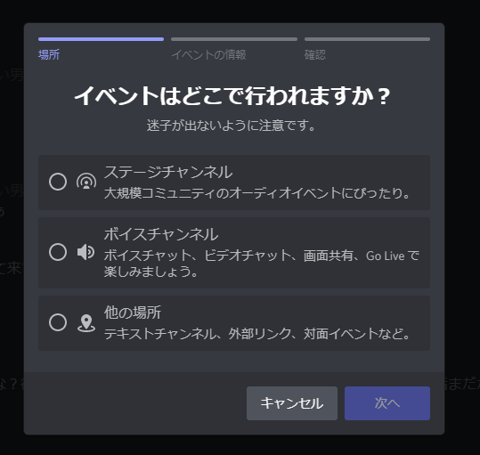
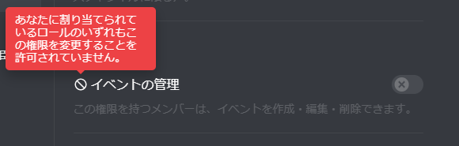

# にゃーんロールにイベント管理権限を付与

にゃーん～!

# 1 Summary

この RFCs では限界開発鯖内のロール **"にゃーん"**(鯖内権限) に イベント管理権限(`Management_Events`) を付与することを提案します。

# 2 Motivation

Discord では現在ごく一部の Discord サーバーで イベント機能 というのを実装しています。これは Discord サーバー内でいろんなイベントを計画・実行できる機能です。対応しているイベント形式は以下の通りです。

| イベント           | 形式                                                                                                  |
| ------------------ | ----------------------------------------------------------------------------------------------------- |
| ステージチャンネル | 大規模コミュニティーで利用できるステージチャンネルを使ったイベントの運営に最適 限界開発鯖では使えない |
| ボイスチャンネル   | Go Live・ビデオチャットなどボイスチャンネルで楽しむイベント運営に最適                                 |
| 他の場所           | 例えば いっそうさん「めるさん、茨城来ない？」など、特定の場所で会うイベントの運営に最適               |

この表を見ていただくとわかると思いますが、 "限界オフ" や "限界突発 LT" などイベントを行う我々にとってはとても役に立つ物だと思います。

> 英語が読める方は公式の記事を読んでみて。
>
> [Scheduled Events - Discord ヘルプセンター](https://support.discord.com/hc/ja/articles/4409494125719)

これらのイベントを開始するには [1 Summary](#1Summary) で記述したイベント管理権限が必要になるわけです。

これは `Webhookの権限` や `メンバーをBAN` ・ `メンバーをKICK` などの限界開発鯖を根本から破壊する Discord における重大な権限でありません。(イベントを開始・削除をするだけで通知が来たりするわけではないため。)

そのため、リスクも少ないことから **限界開発鯖におけるメンバーシップ権限ロール "にゃーん" にイベント管理権限を付与することを提案します。**

# 3 Guild-level Explanation

この RFCs により以下の権限が変更されます。

| ロール対象 | 付与する権限   | 付与対象                                                                                                                 |
| ---------- | -------------- | ------------------------------------------------------------------------------------------------------------------------ |
| にゃーん   | イベントの管理 | 限界開発鯖全メンバーのうち `限界治安部隊・全知全能の神` を持ったユーザー及び所有者権限をもったいっそうさんを除いた 80 人 |

---

# Drawbacks

今の所ありませんが、ベータ版のため正式版が出てくるまで使えなくなったりする可能性があります。
